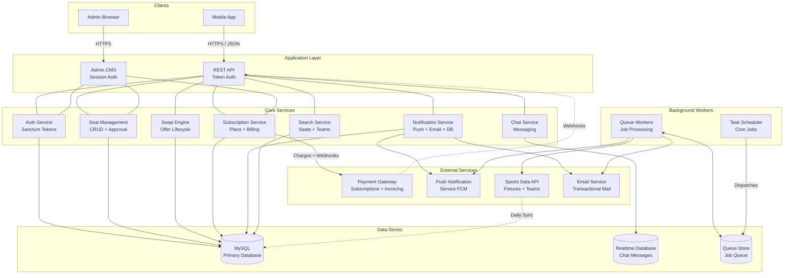
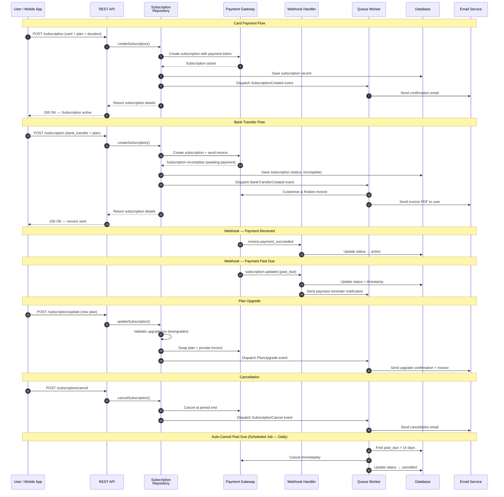

# Sports Seat Swapping Marketplace — Backend Platform

A production-grade backend system powering a sports seat swapping marketplace, built with Laravel and designed to scale across multiple sports, regions, and mobile clients.

This repository represents a **real-world commercial project**. Source code is private due to confidentiality, but this documentation outlines the system architecture, technical decisions, and my contributions as Lead Backend Developer.

---

## Overview

The platform enables sports fans to:
- List stadium seats for upcoming events
- Discover and exchange seats with other users
- Communicate via real-time chat
- Subscribe to premium access tiers
- Receive push notifications and transactional emails

It serves **iOS and Android mobile applications** via a versioned REST API and includes a full-featured **Admin CMS** for internal operations.

---

## Tech Stack

**Backend**
- Laravel 10 · PHP 8.2
- MySQL · Redis
- RESTful APIs (versioned)
- Laravel Sanctum (API authentication)
- Stripe (subscriptions & billing)
- Firebase Cloud Messaging (push notifications)

**Admin CMS**
- Blade Templates
- Server-side DataTables
- Vite asset bundling

**DevOps & Quality**
- CI/CD pipeline
- PHPUnit testing
- Static code analysis
- Queues & scheduled tasks

---

## Key Capabilities

- 80+ REST API endpoints for mobile clients
- Subscription billing with Stripe (full lifecycle)
- Seat listings, swap offers, and approval workflows
- Real-time chat and push notifications
- Identity verification with admin moderation
- Automated background jobs and scheduled tasks
- Multi-sport data ingestion from external APIs

---

## Architecture

> Diagrams reflect the real production system. Source code is confidential.

### System Architecture

### Stripe Payment Flow

📁 **More diagrams:** [API Architecture](./docs/api-architecture.md) · [Firebase Notifications](./docs/firebase-notifications.md) · [Chat Architecture](./docs/chat-architecture.md) · [Database Schema](./docs/database-schema.md)

---

## My Role

**Lead Backend Developer**

- Designed the system architecture and API structure
- Built the REST API and Admin CMS
- Designed the database schema and domain models
- Implemented Stripe billing and webhook handling
- Integrated Firebase push notifications and real-time chat
- Built background jobs, schedulers, and data pipelines
- Led backend development and technical decision-making

---

## Documentation

Detailed technical documentation is available here:

📁 **[`/docs`](./docs)**  
- Architecture & design patterns  
- API structure  
- Database schema  
- Background processing  
- Security & integrations  

---

## Note on Source Code

This is a **proprietary commercial project**.  
The source code is not publicly available.  
This repository is shared **for portfolio and technical demonstration purposes only**.

---

**Author:** Ali Hamza  
**Role:** Senior / Lead Backend Engineer
