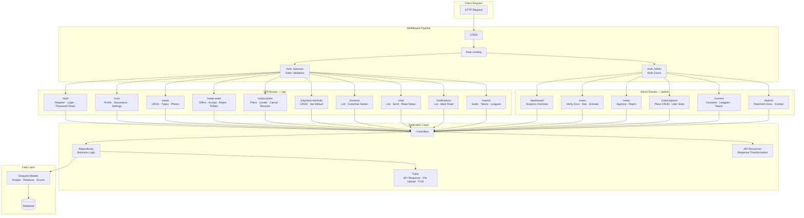

# API Architecture

The API uses a versioned RESTful design with Sanctum token authentication. Requests pass through a middleware pipeline before reaching controllers, which delegate to a Repository layer for business logic. API responses follow a consistent envelope format via a shared response trait. The admin panel runs as a separate route group with session-based auth and role-based access control.

## Design Patterns

| Pattern | Implementation | Purpose |
|---------|---------------|---------|
| Repository | `app/Repositories/` | Separates business logic from controllers |
| API Resource | `app/Http/Resources/` | Consistent response transformation |
| Trait-based composition | `ApiResponseTrait`, `FileUploadTrait`, `SendFcmNotificationTrait` | Reusable cross-cutting concerns |
| Form Request validation | `app/Http/Requests/` | Request validation separated from controllers |
| Enum status management | `SeatStatus`, `SwapSeatOfferStatus` | Type-safe status handling |
