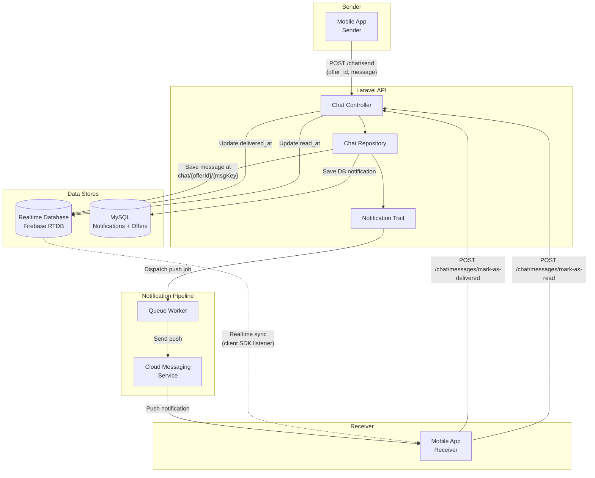
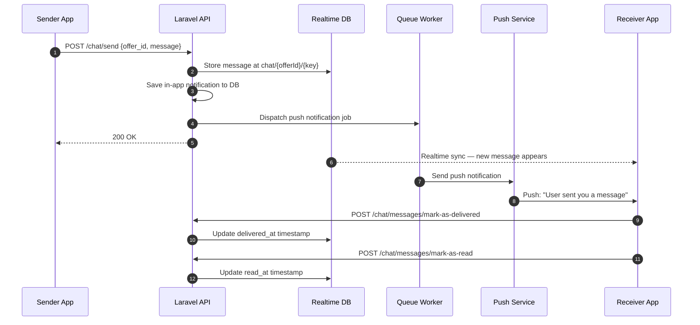

# Real-Time Chat Architecture

Chat is scoped to swap offers — when two users have an active swap, a chat channel opens between them. Messages are persisted in Firebase Realtime Database, enabling instant sync on the client side. The Laravel API handles message creation, delivery/read receipts, and chat lifecycle (soft-delete with business rule enforcement). Each new message also triggers an in-app notification and a push notification to the recipient.

## System Overview



## Message Lifecycle



## Message Data Structure

```json
{
  "sender_id": 42,
  "receiver_id": 17,
  "message": "Is the seat still available?",
  "delivered_at": "",
  "read_at": "",
  "send_at": 1700000000,
  "deleted_by_sender": false,
  "deleted_by_receiver": false
}
```

## Chat Business Rules

| Rule | Description |
|------|-------------|
| Scoped to swap offers | Chat only exists between users with an active swap offer |
| Soft delete | Messages marked as `deleted_by_sender/receiver`, not removed |
| Delete protection | Cannot delete chat on accepted offers until both matches finish (120+ min) |
| Active flags | `sender_chat_active` / `receiver_chat_active` control visibility |

## API Endpoints

| Method | Endpoint | Description |
|--------|----------|-------------|
| GET | `/chat/list` | Get all chat conversations |
| POST | `/chat/send` | Send a message |
| POST | `/chat/messages/mark-as-delivered` | Mark messages as delivered |
| POST | `/chat/messages/mark-as-read` | Mark messages as read |
| DELETE | `/chat/delete/{offer_id}` | Soft-delete a chat conversation |
