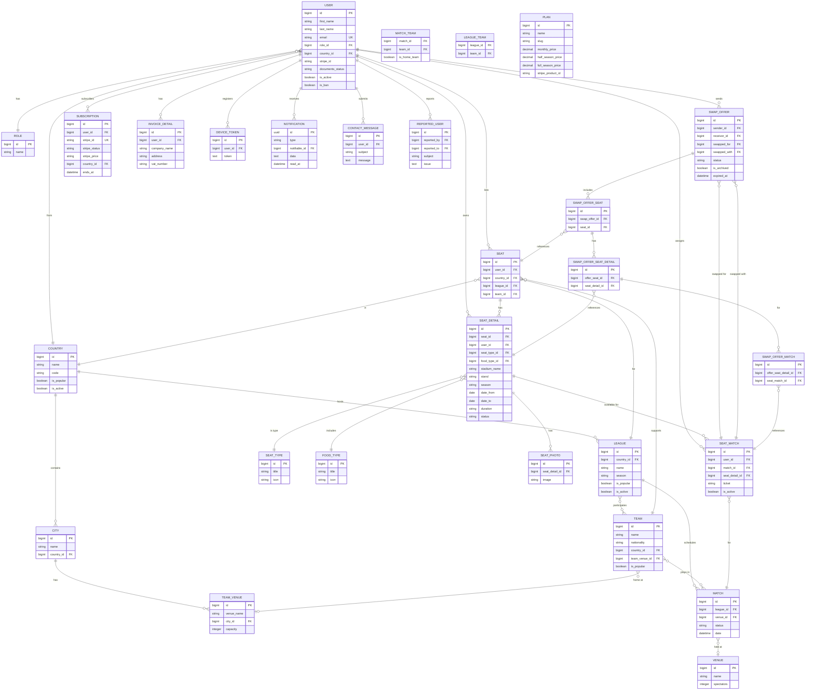

# Database Schema (ERD)

The schema centers around **Users** who list **Seats** at sporting venues, linked to **Matches** from an external sports data pipeline. Users create **Swap Offers** to trade seats for specific matches. The system also manages **Subscriptions** (with plan tiers), **Chat Messages** (via external realtime DB), **Notifications**, and admin-managed reference data like **Countries**, **Leagues**, and **Teams**.

## Table Summary

| Domain | Tables | Description |
|--------|--------|-------------|
| Users | `users`, `roles`, `device_tokens` | User accounts, roles, push tokens |
| Geography | `countries`, `cities` | Location reference data |
| Sports | `leagues`, `teams`, `matches`, `venues`, `team_venues` | External sports data |
| Pivot | `match_team`, `league_team` | Many-to-many relationships |
| Seats | `seats`, `seat_details`, `seat_types`, `seat_food_types`, `seat_photos`, `seat_matches` | User seat listings |
| Swaps | `swap_offers`, `swap_offer_seats`, `swap_offer_seat_details`, `swap_offer_matches` | Swap negotiation chain |
| Billing | `subscriptions`, `subscription_items`, `plans`, `invoice_customer_details` | Payment & subscription management |
| System | `notifications`, `jobs`, `job_batches`, `failed_jobs`, `contact_messages`, `reported_users` | Platform operations |
