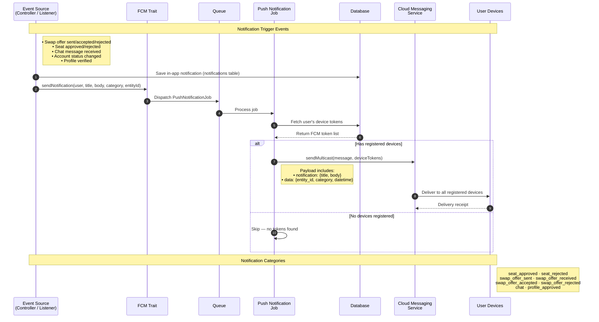

# Push Notification Flow

Push notifications are dispatched asynchronously via a queue job. When a triggering event occurs (swap offer, seat approval, chat message, account status change), the system saves an in-app notification to the database and dispatches a background job that sends a multicast push to all of the user's registered devices via Firebase Cloud Messaging.

## Device Token Management

- Tokens are registered during **login** and **signup** (one per device)
- Multiple tokens per user supported (multi-device)
- Stored in a dedicated `device_tokens` table
- `updateOrCreate` ensures no duplicates

## Notification Channels

| Channel | Purpose | Delivery |
|---------|---------|----------|
| Database | In-app notification feed | Synchronous |
| FCM Push | Mobile device alerts | Async via queue |
| Email | Subscription & account events | Async via queue |
