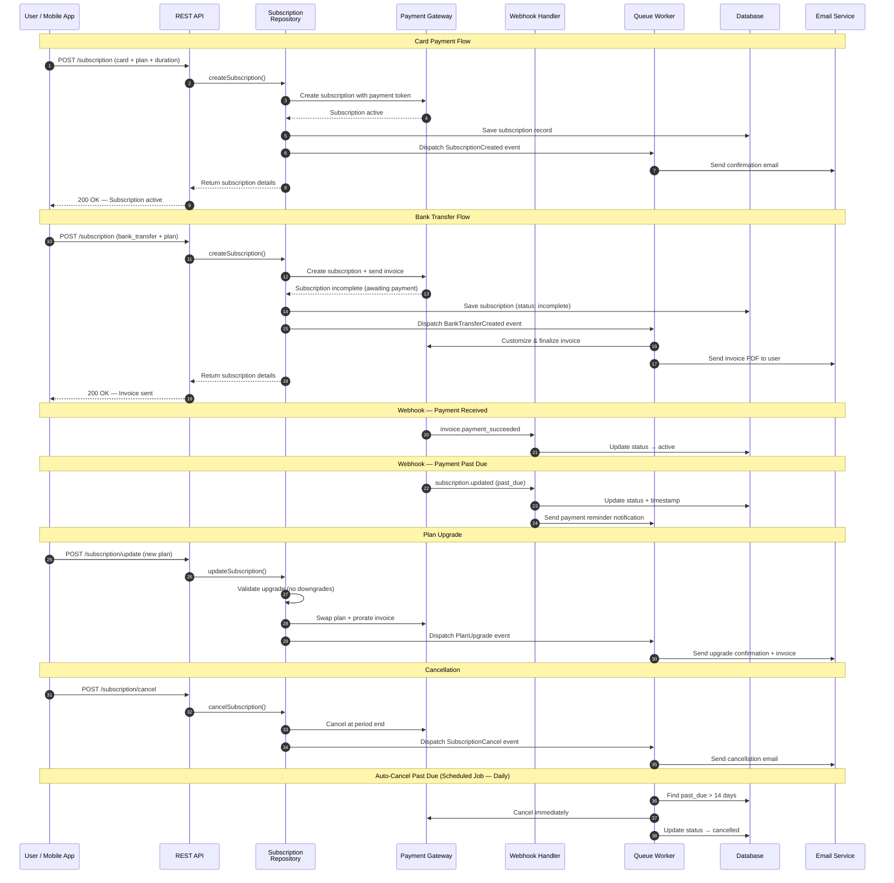

# Subscription & Payment Flow

The platform supports two payment methods: **card payments** (immediate charge) and **bank transfer** (invoice-based). Subscriptions are managed through a payment gateway SDK with full lifecycle support — creation, upgrades, cancellation, and automatic past-due handling. Webhook events keep the system in sync with the payment provider's state, and a scheduled job auto-cancels subscriptions that remain unpaid after 14 days.

## Subscription Plans

| Duration | Billing Interval | Description |
|----------|-----------------|-------------|
| Monthly | 1 month | Rolling monthly subscription |
| Half Season | 6 months | Mid-season commitment |
| Full Season | 12 months | Full year with discount |

## Webhook Events Handled

| Event | Action |
|-------|--------|
| `invoice.payment_succeeded` | Activate subscription (bank transfers) |
| `invoice.payment_failed` | Log failure |
| `subscription.updated` | Sync status; send reminder if past_due |
| `subscription.deleted` | Mark as cancelled |
