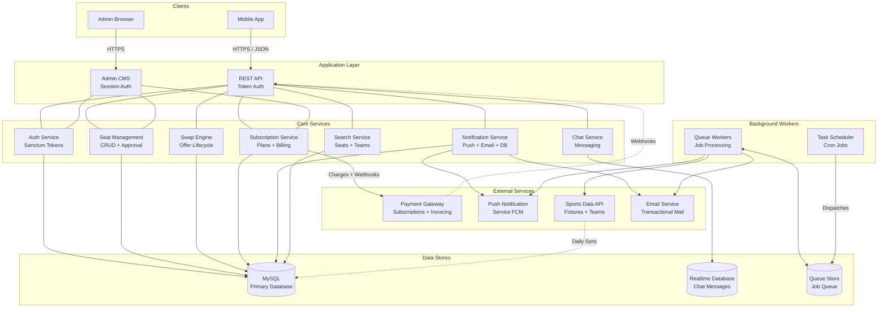

# High-Level System Architecture

The platform follows a service-oriented architecture with a Laravel monolith at its core. The API serves mobile clients via token-based auth, while the Admin CMS uses session-based auth. Background workers handle sports data ingestion, notification delivery, and subscription lifecycle management. External integrations include a payment gateway, push notification service, and a third-party sports data feed.

## Key Components

| Component | Technology | Purpose |
|-----------|-----------|---------|
| REST API | Laravel + Sanctum | Mobile client endpoints |
| Admin CMS | Laravel + Blade | Content & user management |
| Database | MySQL | Primary data store |
| Realtime DB | Firebase RTDB | Chat message persistence |
| Queue | Database driver | Async job processing |
| Payment | Stripe via Cashier | Subscriptions & invoicing |
| Push Notifications | Firebase Cloud Messaging | Mobile push delivery |
| Sports Data | SportCC API | Fixture & team data sync |
| Email | Configured mail driver | Transactional emails |
